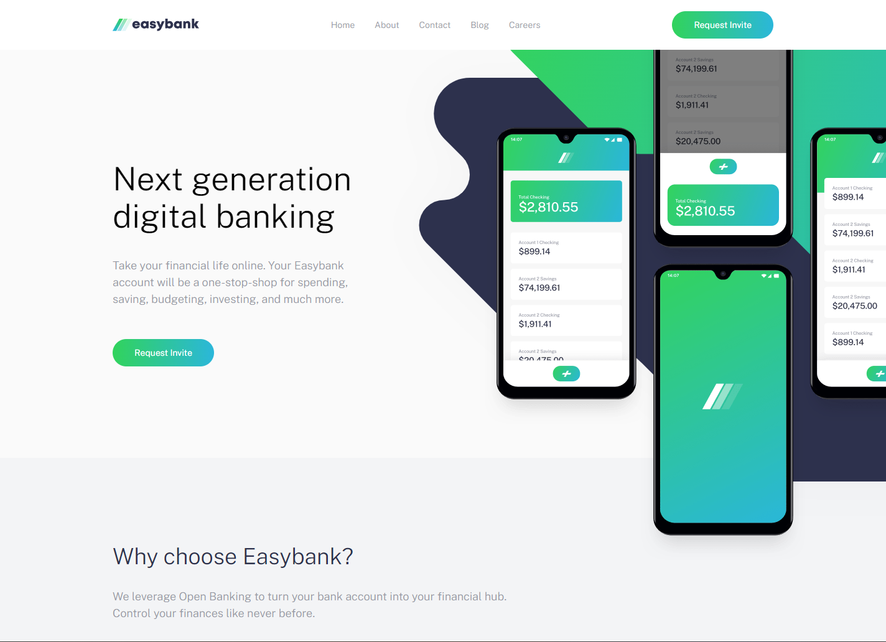

# Easybank Landing Page

[Easybank Landing Page](https://abdelrahman-mh.github.io/easybank-landing-page/) web site designed by vanilla Html, Css (with Sass) and Javascript, using [Webpack](https://webpack.js.org/), challenge by [Frontend Mentor](https://www.frontendmentor.io/challenges/easybank-landing-page-WaUhkoDN) **Coded by** [Abdel-Rahman](https://github.com/abdelrahman-mh)

## Table of contents

-  [Installation](#installation)
-  [Getting Started](#getting-started)
-  [Screenshots](#screenshots)
-  [Configuration](#configuration)
-  [Project Patterns](#project-patterns)
   -  [Directory Structure](#directory-structure)
   -  [Webpack Integration](#webpack-integration)
   -  [Asset Handling](#asset-handling)
-  [Contributing Guidelines](#contributing-guidelines)
   -  [Features To Add](#features-to-add)
-  [Dependencies and Tools](#dependencies-and-tools)
-  [Links](#links)

## Installation

1. Clone the repository then navigate to the project directory:

   ```bash
   git clone https://github.com/abdelrahman-mh/easybank-landing-page.git
   cd easybank-landing-page
   ```

2. Install dependencies:

   ```bash
   npm install
   ```

## Getting Started

Start the development server:

```bash
npm run dev
```

After running the development server with `npm run dev`, the application will automatically open in your browser. If not, you can access it at [http://localhost:3000](http://localhost:3000).

Or, you can build the app by running:

```bash
npm run build
```

This will generate the `./dist` folder, and you can run the static `index.html` file.

## Screenshots



## Configuration

The app is built with Webpack. Additionally, we use [Autoprefixer](https://github.com/postcss/autoprefixer) with [PostCSS](https://postcss.org/), and the `.browserslistrc` is utilized to specify a list of browsers for compatibility. For more details, check [Browserslist](https://browsersl.ist/).

## Project Patterns

This is a simple static web project, Here's a breakdown of the main components:

#### Directory Structure

-  **`./src` Directory**: All main files for the App includes Html, Styles, Scripts, Assets

#### Webpack Integration

Webpack deals with deferent files include all files inside `./src` dir

-  **Webpack Output**:
   -  The final bundled JavaScript and CSS files are generated based on the Webpack configuration, In output folder `./dist/`

#### Asset Handling

Assets, including images, fonts, etc., are managed effortlessly:

-  **Asset URLs**: All assets are accessible under the `assetsFolder/file` URL structure.

## Contributing Guidelines

We welcome contributions! If you have suggestions, find bugs, or want to add new features, follow these steps:

1. Open an issue to discuss your proposal.
2. Fork the repository and create a new branch for your feature.
3. Submit a pull request with your changes.

### Features To Add

-  [ ] Images Optimization
-  [ ] Enhance Lighthouse performance
-  [ ] Minimize Classes names and selectors
-  [ ] Enhance Webpack configuration

## Dependencies and Tools

-  Webpack
-  Sass

## Links

-  [Website](https://abdelrahman-mh.github.io/easybank-landing-page/)
